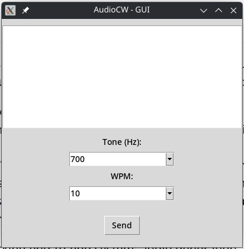

# AudioCW

[Video Demonstration](https://youtu.be/ZHlFYsn0uYY )

## Goal:
This project explores Morse code (CW) as a learning tool for computer science. The current implementation uses C++ to generate 
Morse code audio from text input, producing raw .wav files through direct digital signal processing. 

This first stage was intentionally math-intensive, giving a hands-on introduction to the principles of audio synthesis and signal representation.
The next phase, where this course comes in, focuses on decoding received Morse signals. The original design relied on sending a series of “V” characters as a calibration sequence, 
allowing the receiver to manually tune in on the correct words-per-minute (WPM) speed and tone frequency. A more ambitious approach would be to apply machine learning to automate this process. 
Using the Kaggle Morse dataset (or a comparable dataset), the project could analyze audio samples to determine the signal-to-noise ratio, tone frequency, and transmission speed, ultimately predicting WPM and decoding incoming messages.

This has the potential to evolve into a working end-to-end system: audio generation, signal analysis, and automated decoding. Such a project would be valuable not only for students of computer science, 
but also for those interested in telecommunications, audio processing, and applied machine learning.https://youtu.be/ZHlFYsn0uYY 

This theoretical ML Signal RX app would finally be implemented on a [BOE bot chassis driver](https://github.com/allhailthetail/boenanna-pi) implementation project and/or as a piece of [another project](https://github.com/cris1618/MazeBot) that focuses on Djikstra’s Shortest Path.

## Progress:

[X] Develop TK GUI
[X] Develop Sending Backend (C++/DSP Implementation)
[ ] RX Backend - ML Implementation?
    [ ] Synthetic training data?
[ ] Integrate with BOE chassis driver
[ ] Integrate with Djikstra Project
